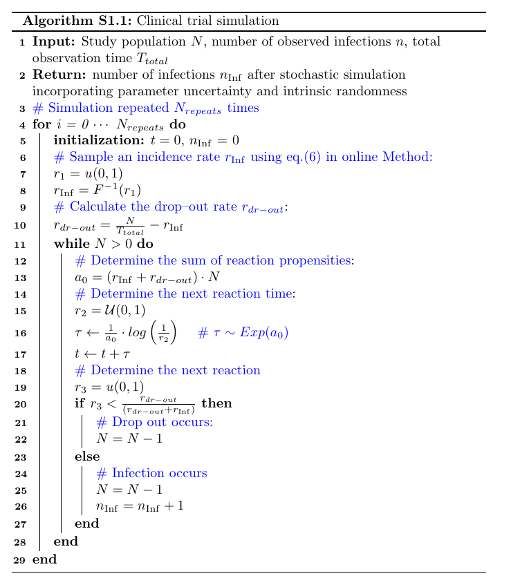

## Top-down
Inside the 'top_down' folder, you will find various scripts that serve different purposes:
* simulation_utils.py: contains several functions essential for simulating clinical trials. It facilitates tasks such as calculating the probability density function (PDF) of infection incidence, sampling infection incidence from the PDF, and conducting clinical simulations.The clinical trial is simulated using Gillespie algorithm as follows:



 For more information, refer to the online Method section. 
* efficacy_estimator.py: this script is designed to estimate the distribution of PrEP efficacy for the 'drug detected' group within a clinical trial. The estimation is done without any preconceived assumptions about efficacy. The script's output corresponds to the panels G and H in Figure 2. 
* hypotheses_tester.py: utilized to validate proposed hypotheses in the bottom-up approach using clinical data. The outcomes produced by this script align with the results presented in Table 2. For detailed insights, please consult the Results section under *Challenging mechanism-based modelling with clinical data*. 

To estimate the efficacy in drug-detected group:
```
cd top_down/
./efficacy_estimator.py
```
The desired clinical study has to be chosen: 
```commandline
Please choose one clinical study (Options: HPTN084, Partners, TDF2, VOICE, FEM): 
```
After choosing the clinical study, the simulations will run for the corresponding study. The result is a dictionary encapsulating the probability distribution of efficacy. This dictionary is structured with 'efficacy' as the key and is categorically partitioned into 100 intervals, spanning the full range from 0% to 100%. The associated values signify the frequency of each respective efficacy interval. This dictionary will be stored in a pkl file named to the clinical trial 'dict_clinicalTrial.pkl'


To test the hypotheses with the clinical data:
```
cd top_down/
./hypotheses_tester.py
```
The desired clinical study has to be chosen: 
```commandline
Please choose one clinical study (Options: HPTN084, Partners, TDF2, VOICE, FEM): 
```
After choosing the clinical study, the testing will be performed for the corresponding study. The results will be printed and also saved in a npy file named identical to the clinical trial 'clinicalTrial.npy'

## Bottom-up
The 'bottom_up' folder contains scripts and packages designed for the 'bottom-up' modeling detailed in the paper. This part's core goal is to compute the PrEP efficacy of TDF/FTC under the hypothesized mechanism. 
* Package 'Vectorized_clean': compute the prophylactic efficacy 
in a vectorized way, i.e. this package can compute the PrEP efficacy trajectory of multiple 
regimens for multiple individuals in a single run. For detailed usage of this package you can 
check the examples in 'bottom_up/Vectorized_clean/example.ipynb'. 
* compute_pe.py: compute the extinction probability for TDF/FTC on cis-gender women, considering different hypothetical scenarios and their combinations (as elucidated in the Results section). Here we use an example file (data/dosing.csv) containing 
7 dosing regimens for 90 days long, i.e. once per week to 7 times per week. The pharmacokinetic parameters 
of 1000 virtual individuals are used (parameters in data/pk). This computation can be slow since it computes the extinction probability profile for 1000 individuals. 
* utils.py: contains helper functions for the computation of PrEP efficacy, e.g. function to calculate 
the probability of different inoculum size.
* compute_efficacy: compute the PrEP efficacy for a given dose and regimen and save the efficacy profile 
as a numpy array. 
To run the bottom-up  analysis:
```
cd bottom_up/
./compute_efficacy.py
```
You'll be prompted to specify the dose of interest and the duration of the regimen:
```
Please enter the number of doses per week: 
Please enter the duration of regimen in days: 
```
After entering the numbers the computation will run and the efficacy profile of each combination of hypotheses 
will be stored automatically in npy files.  

## About data
The folder 'data' contains pre-generated data that are necessary for the top-down and bottom-up analysis. 
* dosing.csv: contains 7 boolean arrays which represent respectively the dosing regimens that 1, 2, ... 7 doses will be taken every week, where 1 denotes dose taking and 0 represents missing. It's used to compute the PrEP efficacy in the bottom-up approach.
* pk: there are two files (which are also the Supplementary dataset referenced in the online Method) containing the pharmacokinetic parameters of 1000 virtual patients for TDF (SupplementaryDataset2.csv) and FTC (SupplementaryDataset1.csv), respectively. They are utilized in the bottom-up approach.
* mmoa: two files containing the matrices computed from molecular mode of action: the matrices represent the relation between TFV-DP and FTC-TP level and direct drug effect. They are used in the bottom-up approach.
* phi: contains several numpy arrays which are precomputed PrEP efficacy trajectories under different hypothesis. 
* tfv_percentage: two files containing the probability that TFV is detectable (above the lower limit of quantification, LLOQ) within different dosing adherence for LLOQ = 0.001uM and 0.035uM respectively. 
* inf: in this folder there are 5 files containing the simulated infection numbers in drug-undetected subgroup of each clinical trial. Used in the top-down approach.  

The forlder 'figures' contains the source data underlying the figures in main manuscript. 
